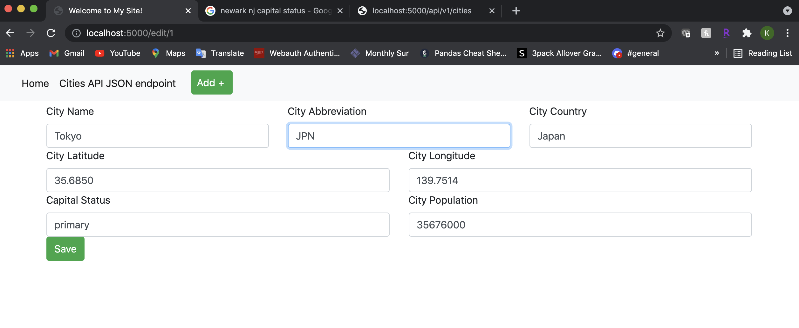

# Project Description
##Homework 5:
This project is a homework assignment to teach us how to create HTML forms in order to
create, update and delete records. As well as learning the usage of Web Forms with
Flask, Docker, Pycharm and MySQL.

## SQL Data Screenshot

## Postman Screenshot

## Home Page (Postman)

## Home Page (Web Page)

## Add New City Form (Web Page)

## City JSON (Postman)
* Specifically looking at New York (2) Record

## City JSON (Web Page)
* Specifically looking at New York (2) Record

## All Cities JSON (Web Page)

## Edit City Form (WebPage)

## View (Postman)
* Specifically looking at New York (2) Record

## View (Web Page)
* Specifically looking at New York (2) Record

## Delete (Postman)
* Before deleting New York (2) Record

## Delete Results (Postman)
* After deleting the New York (2) Record

## Delete Results (Web Page)
* After deleting the New York (2) Record

