# Project Description
This project is a homework assignment to teach us how to create HTML forms in order to
create, update and delete records. As well as learning the usage of Web Forms with
Flask, Docker, Pycharm and MySQL.

## SQL Data Screenshot
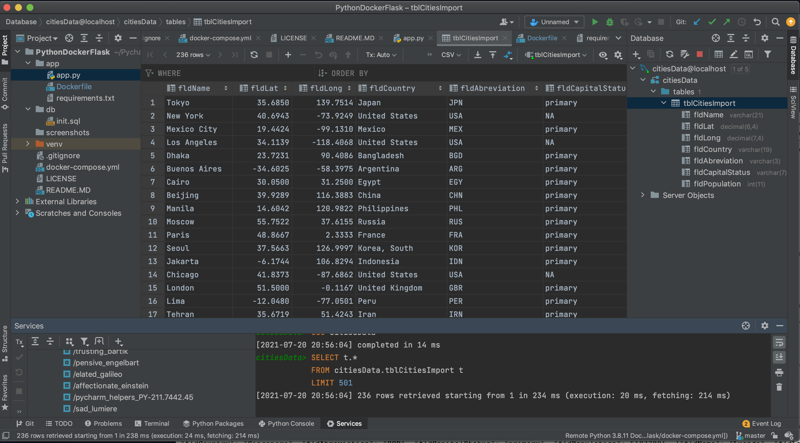

## Postman Screenshot
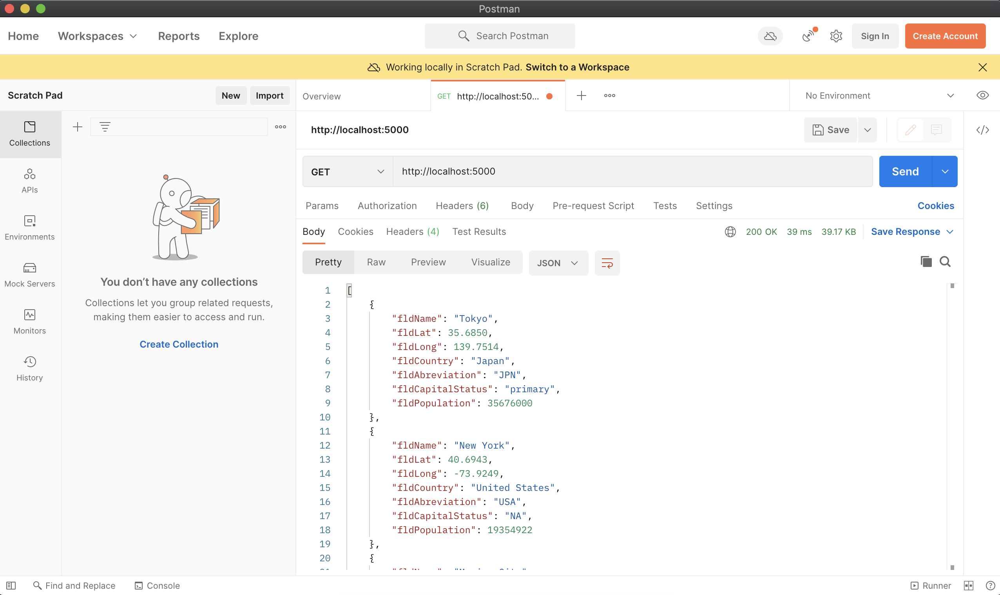

## Home Page (Postman)
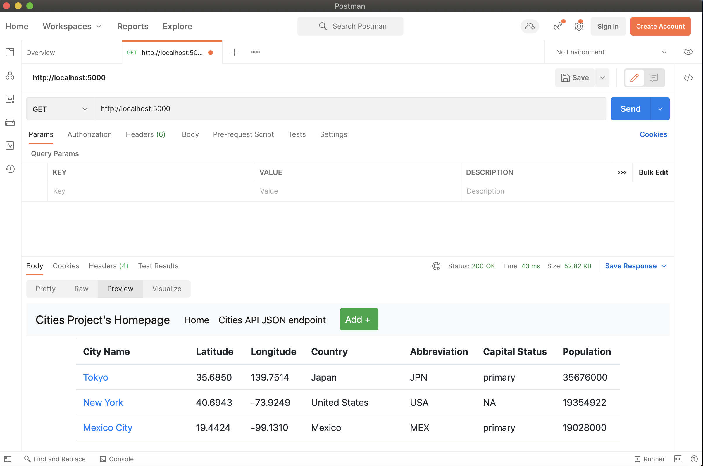

## Home Page (Web Page)
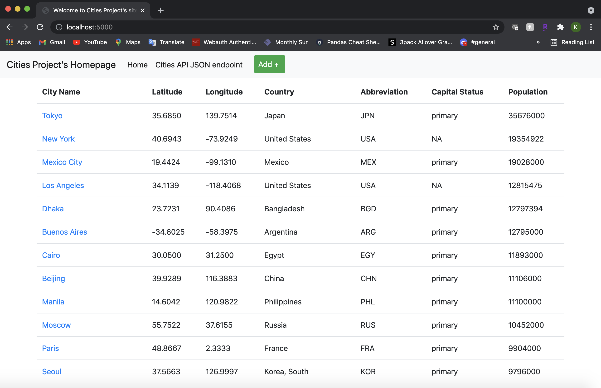

## Add New City Form (Web Page)
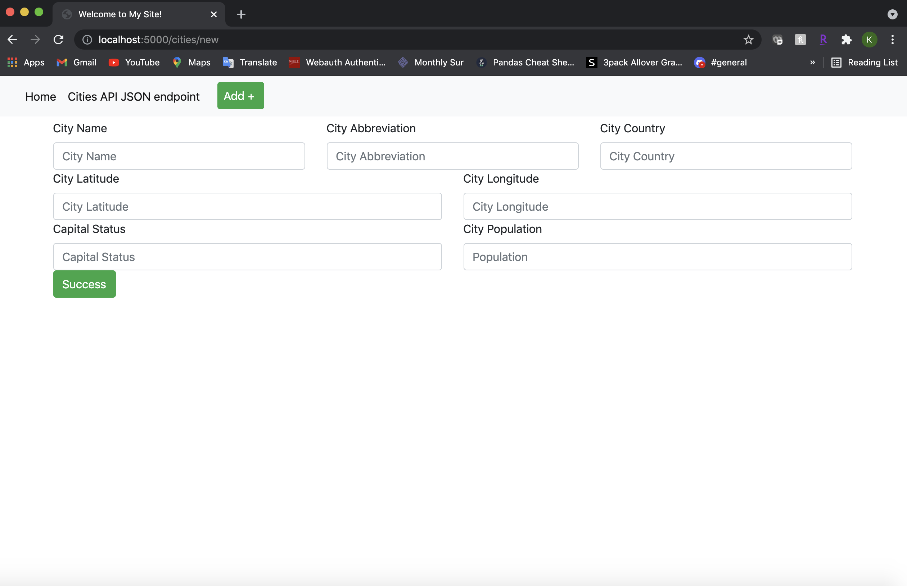

## City JSON (Postman)
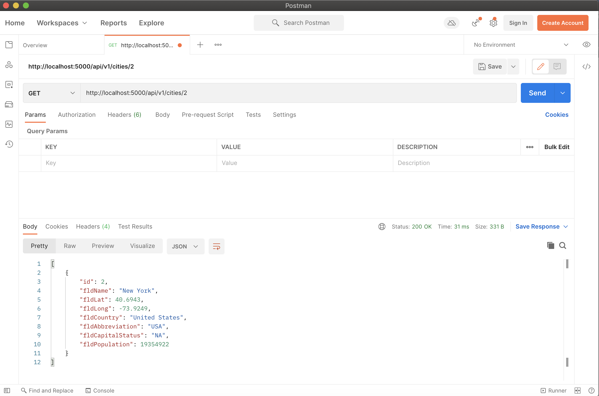

## City JSON (Web Page)
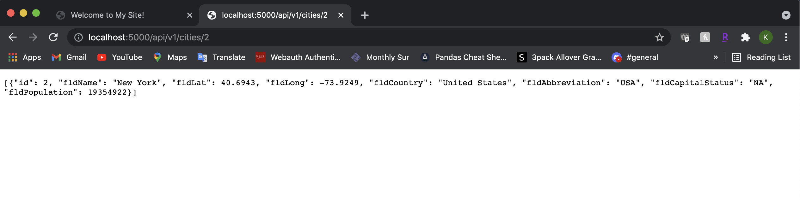

## All Cities JSON (Web Page)
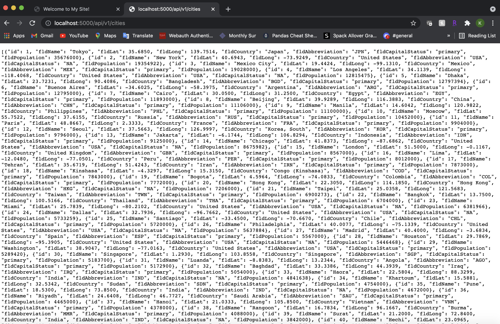

## Edit City Form (WebPage)

## View (Postman)
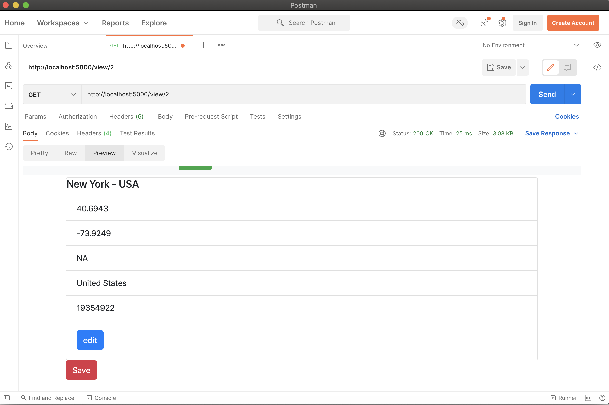

## View (Web Page)
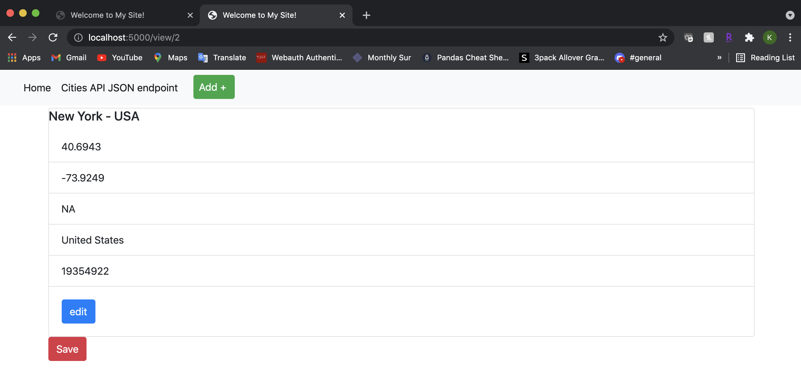

## Delete (Postman)
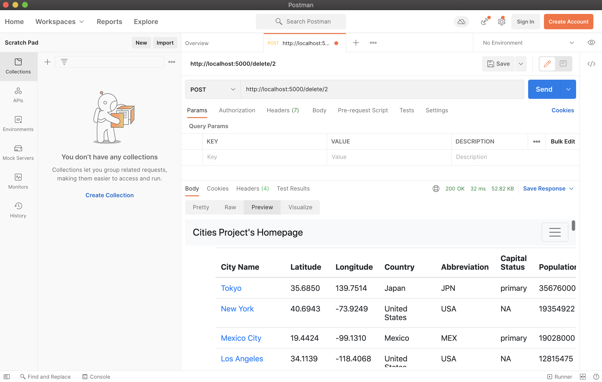

## Delete Results (Postman)
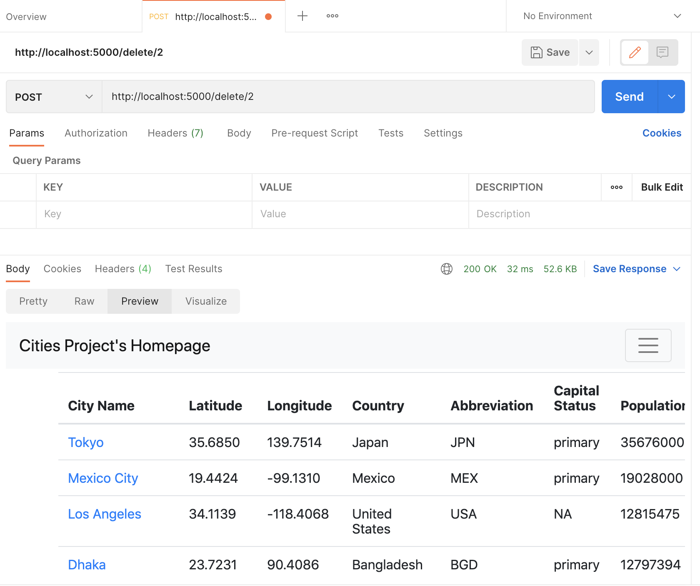

## Delete Results (Web Page)
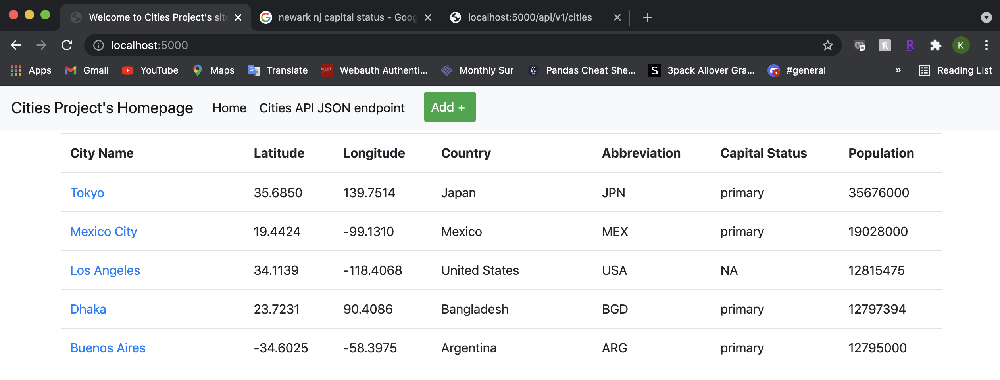