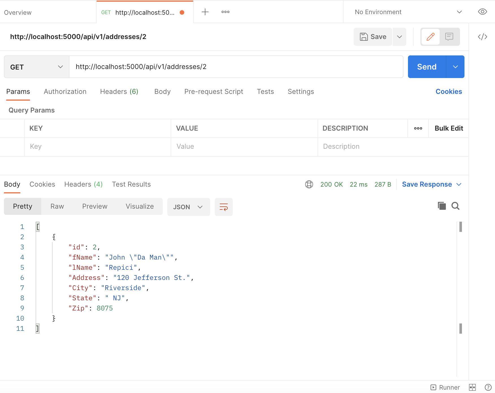
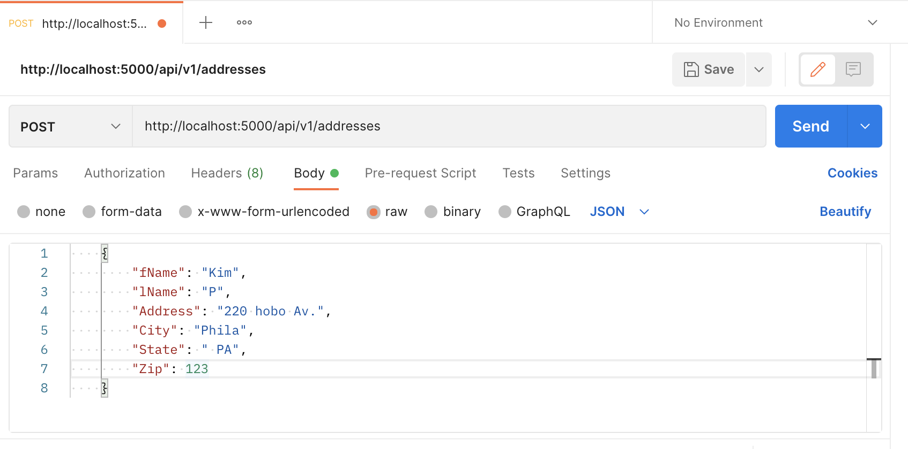
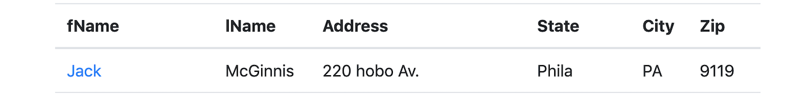
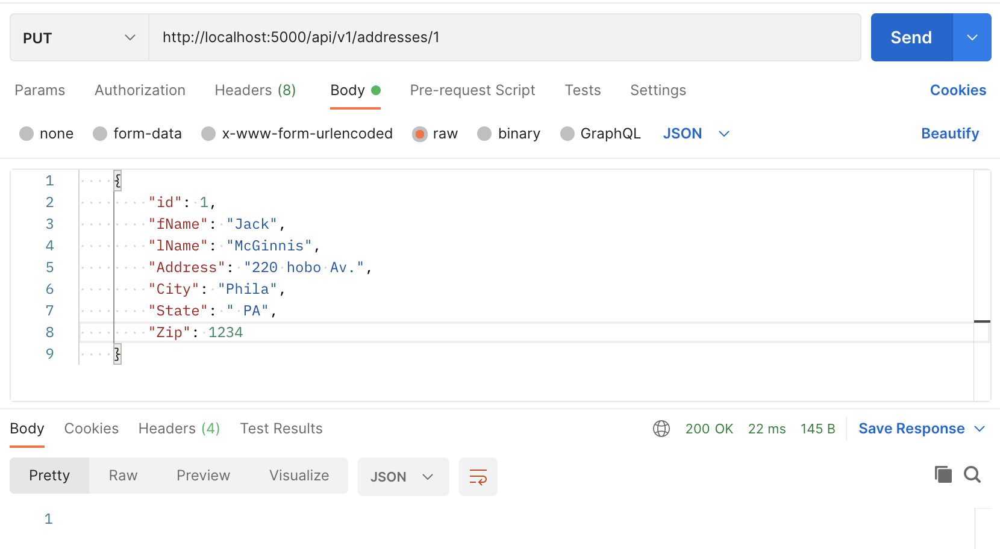
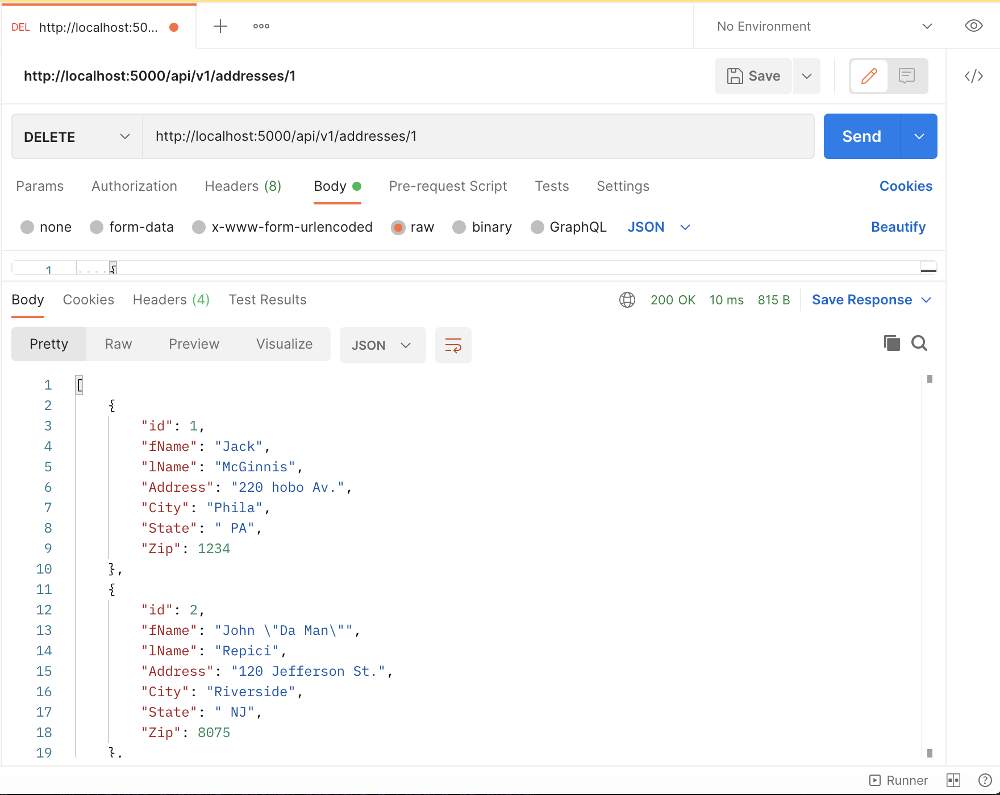
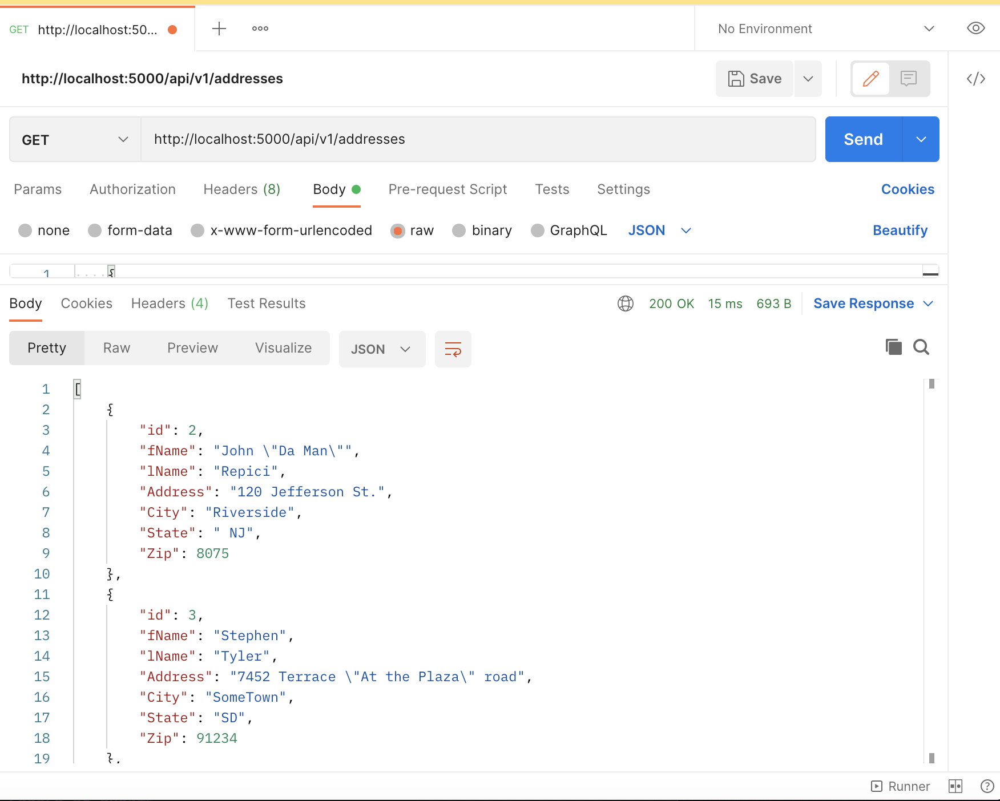

# *Project Description*
Kimberly Padilla
##Project 3:
This project required us to learn REST API with Flask, Docker, PyCharm and MySQL
using our own selected database, in my case being: Addresses.

##*Required Screenshots*
##Project Showing Postman listing all records

## Project Showing Postman showing one record a get request

## Project Showing Postman creating a record by showing the post request
* Creating Kim

## Project Showing Postman editing a record by showing the put request
* Before Editing Jack's Zip Code

* The process of editing Jack's Code with a 200 Status Level (for an after picture with the updated zip code, proceed to the following image)

## Project Showing Postman deleting a record by showing the delete request and the results in the record listing 
* Before Deleting Jack

*After Deleting Jack

